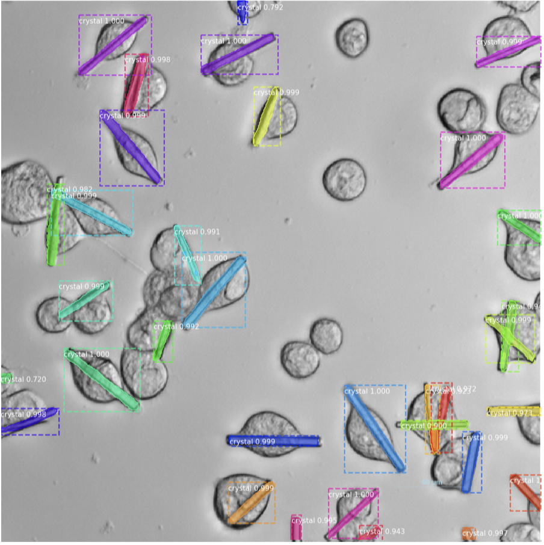

# Convolutional-Neural-Network-Approach-for-the-Automated-Identification-of-in-Cellulo-Crystals

This is an implementation of [Mask R-CNN](https://arxiv.org/abs/1703.06870) on Python 3, Keras, and TensorFlow. The model generates bounding boxes and segmentation masks for each instance of an object in the image, in our approach the objects include different types of crystals, referred as "G" (left image) and "H" (right image).

<p align="center">
  
  
</p>

This repository includes:
* Source code for training the Mask R-CNN model for crystal segmentation
* Mask R-CNN code is from [this repository](https://github.com/matterport/Mask_RCNN)
* SLURM script "masks_rcnn_script.sh" for submitting jobs to the computation cluster, for the paper the [Maxwell Cluster](https://confluence.desy.de/display/MXW/) is used.
* The file "requirements.txt" includes all the libraries relevant to run the project.
* The "utils" folder contains Jupyter Notebooks for pre-processing the images and creating annotation masks from JSON files.

---
**NOTE**
Train/Test images, annotations/masks (in JSON format), all trained models and prediction results are publicly available for download at [Zenodo](https://doi.org/10.5281/zenodo.10475962).

--- 

## Reference to the Mask R-CNN Paper
````
@INPROCEEDINGS{8237584,
  author={He, Kaiming and Gkioxari, Georgia and Dollár, Piotr and Girshick, Ross},
  booktitle={2017 IEEE International Conference on Computer Vision (ICCV)}, 
  title={Mask R-CNN}, 
  year={2017},
  pages={2980-2988},
  doi={10.1109/ICCV.2017.322}}
````

## Reference to the Mask R-CNN Code
````
@misc{matterport_maskrcnn_2017,
  title={Mask R-CNN for object detection and instance segmentation on Keras and TensorFlow},
  author={Waleed Abdulla},
  year={2017},
  publisher={Github},
  journal={GitHub repository},
  howpublished={\url{https://github.com/matterport/Mask_RCNN}},
}
````

## Reference to the Published Papers
````
@article {Kardoost_bioRxiv,
	author = {Amirhossein Kardoost and Robert Sch{\"o}nherr and Carsten Deiter and Lars Redecke and Kristina Lorenzen and Joachim Schulz and I{\~n}aki de Diego},
	title = {Convolutional neural network approach for the automated identification of in cellulo crystals},
	year = {2023},
	doi = {10.1101/2023.03.28.533948},
	publisher = {Cold Spring Harbor Laboratory},
	journal = {bioRxiv}
}

@article {Kardoost_2024,
	author = {Amirhossein Kardoost and Robert Sch{\"o}nherr and Carsten Deiter and Lars Redecke and Kristina Lorenzen and Joachim Schulz and I{\~n}aki de Diego},
	title = {Convolutional neural network approach for the automated identification of in cellulo crystals},
	year = {2024},
	volume = {57},
	doi = {10.1107/S1600576724000682},
	publisher = {IUCR/Wiley},
	journal = {Journal of Applied Crystallography}
}
````
